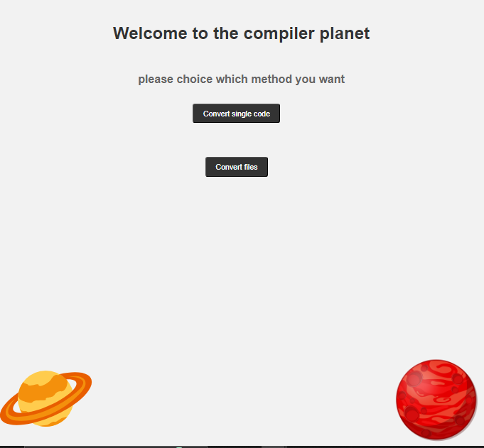

# Compiler-Z
Compiler Z is a compiler built on ANTLR4 that enables the conversion of Flutter code to Android and web platforms.

## Table of Contents

- [Getting Started](#getting-started)
  - [Installation](#installation)
  - [Usage](#usage)
  - [Screen shots](#Screenshots)
- [Contributing](#contributing)
- [License](#license)

## Getting Started

To get started with Compiler Z, follow these steps:

### Installation

1. Clone the repository:

   ```shell git clone https://github.com/Obaa10/Compiler-Z.git```
2. Navigate to the project directory:
  ```cd compiler-z```
3. Install the project dependencies using npm:
  ```npm install```

## Usage
To run Compiler Z, use the following command:
```npm run start```
This command will execute the necessary scripts to start the compiler and convert Flutter code to Android and web platforms.

## Screenshots




## Contributing
Contributions to Compiler Z are welcome! If you want to contribute to the project, please follow these steps:

1. Fork the repository.
2. Create a new branch for your feature or bug fix.
3. Make your changes and commit them with descriptive commit messages.
4. Push your changes to your forked repository.
5. Submit a pull request to the main repository, explaining your changes.
Please ensure that you adhere to the project's coding conventions and follow the established Git workflow.


## License
The Compiler Z project is licensed under the MIT License.

``` Please note that this is a template, and you may want to modify or add more sections based on your project's specific requirements or documentation needs.```
